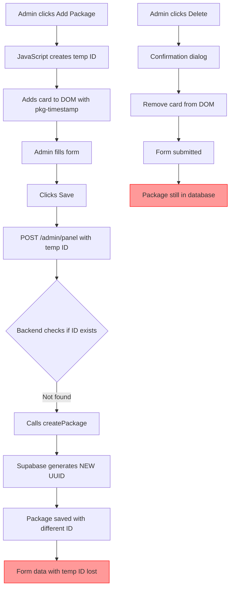
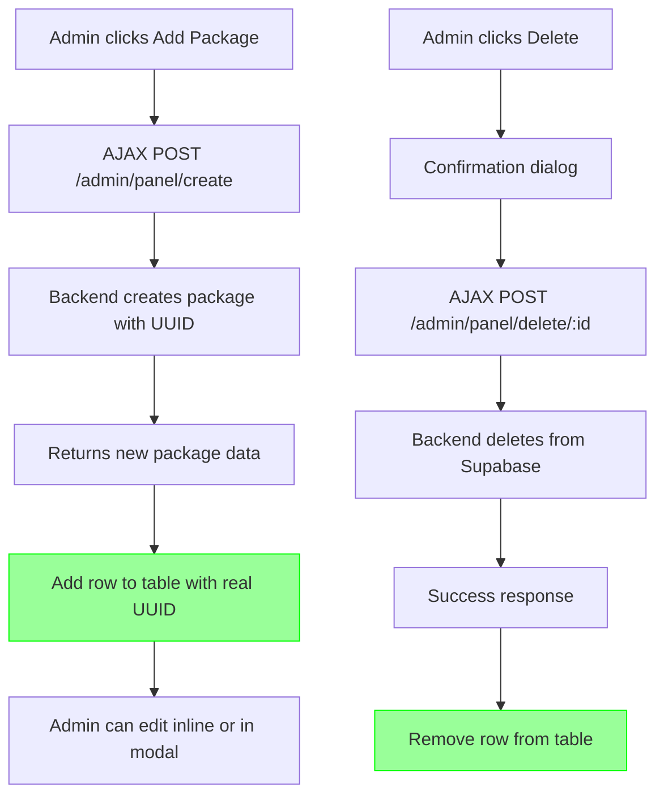
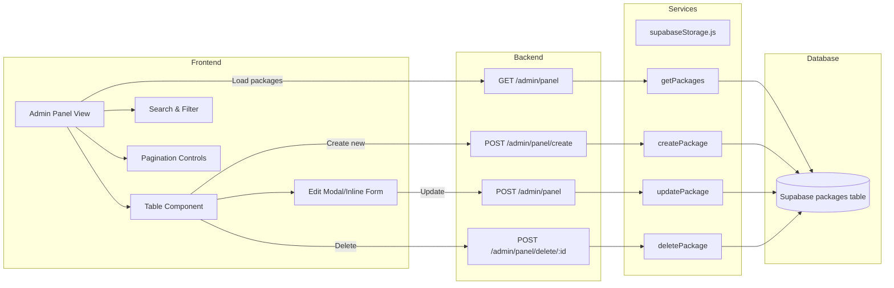
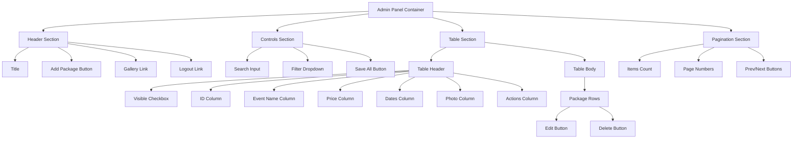
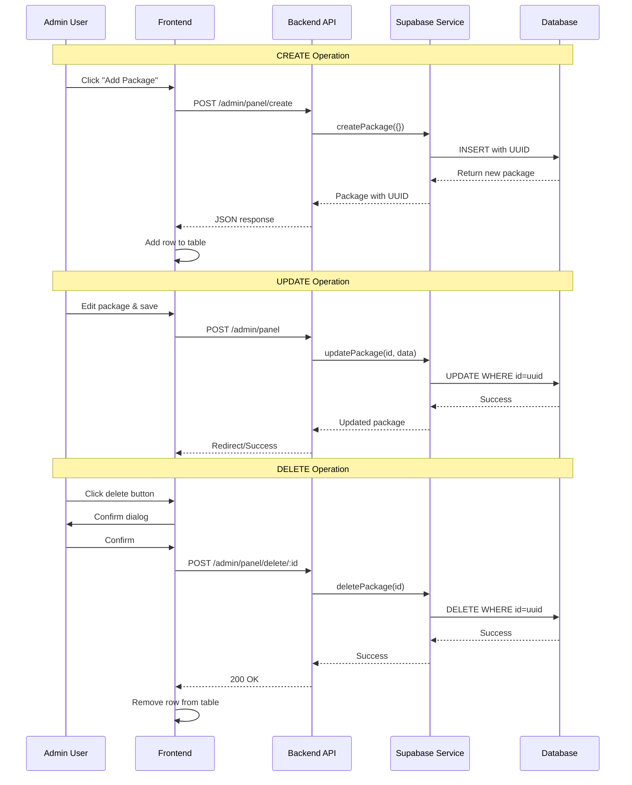
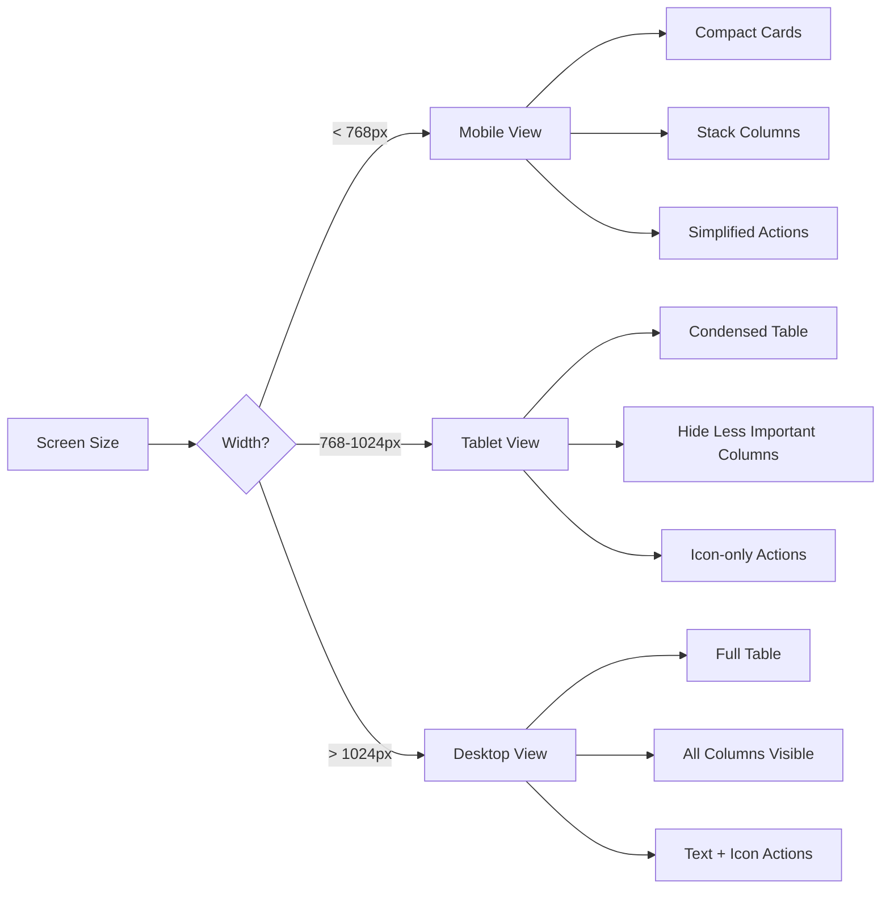
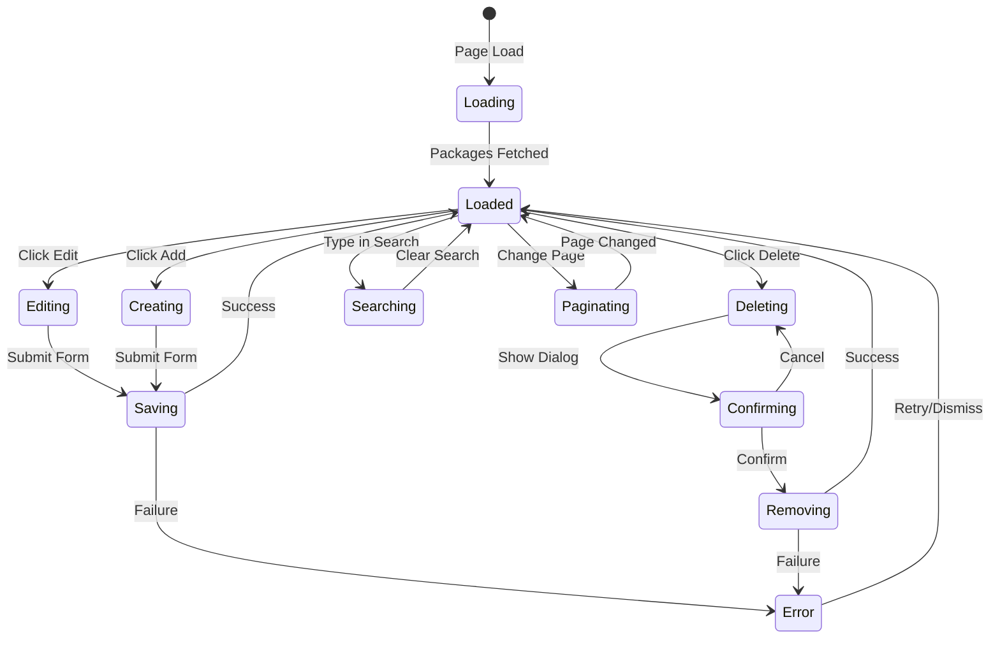
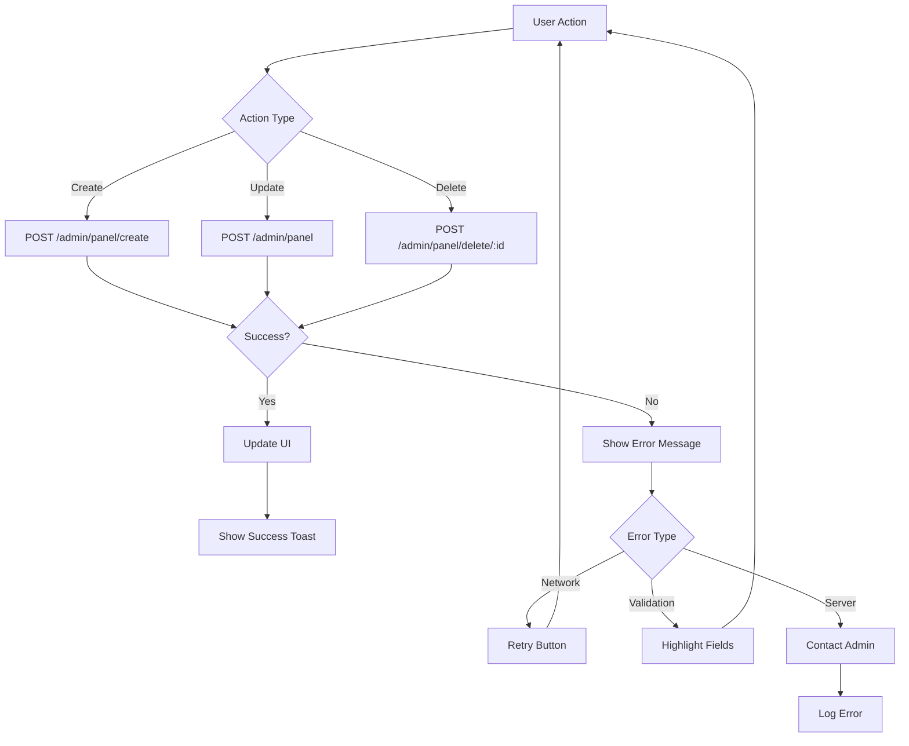
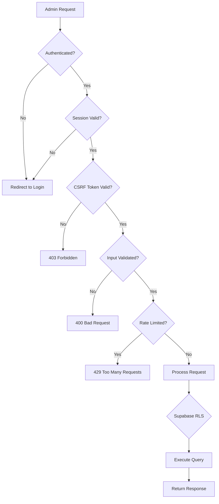
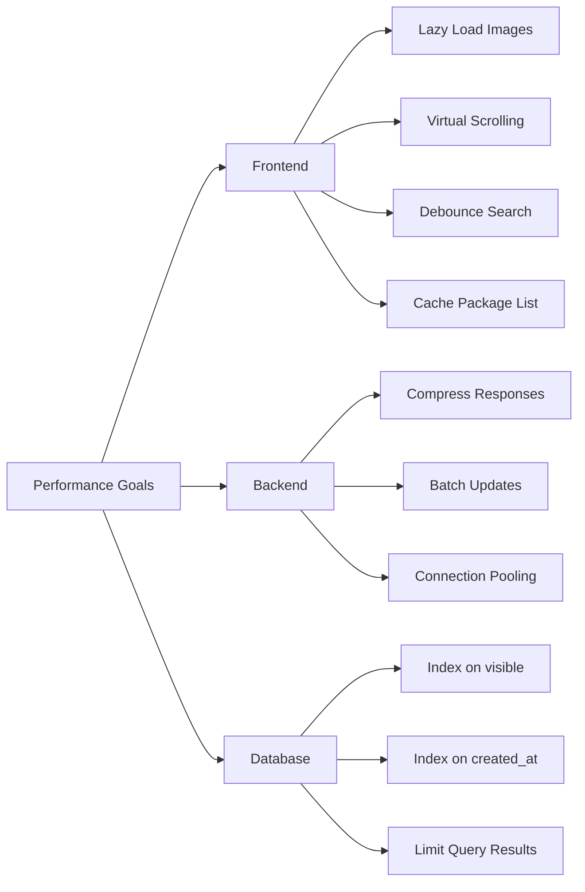

# Admin Panel Architecture Diagram

## Current vs Proposed Architecture

### Current Flow (Broken)

### Proposed Flow (Fixed)

## Component Architecture

## Table Layout Structure

## Data Flow for CRUD Operations

## Responsive Design Breakpoints

## State Management

## Error Handling Flow

## Security Considerations

## Performance Optimization Strategy

