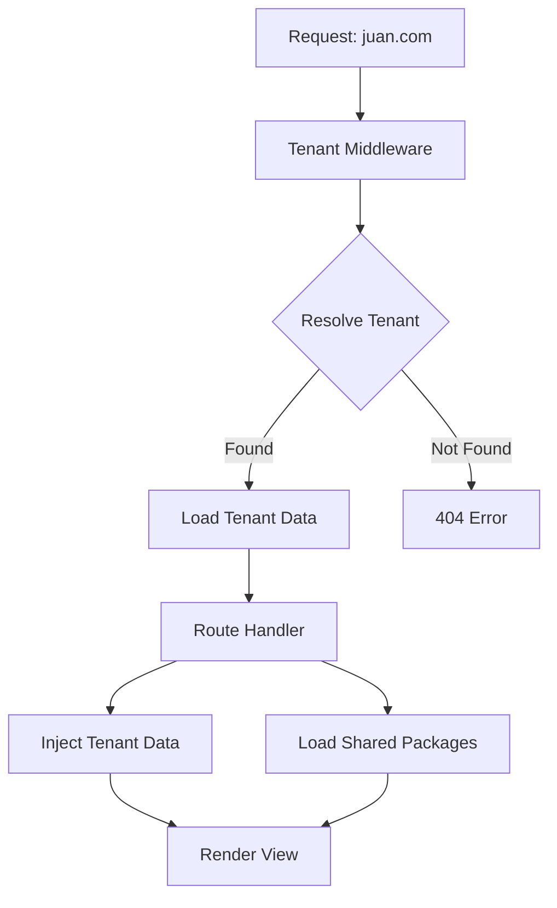

# Multi-Tenant Migration Plan for ManuViajes

## Overview
Convert the current single-tenant travel package site into a multi-tenant system where each tenant (user) has their own domain and displays their specific contact information while sharing the same packages database.

## Architecture Overview



## Database Schema Changes

### 1. Create Tenants Table
```sql
CREATE TABLE tenants (
  id UUID PRIMARY KEY DEFAULT uuid_generate_v4(),
  domain TEXT UNIQUE NOT NULL,
  company_name TEXT NOT NULL,
  email TEXT NOT NULL,
  phone_number TEXT,
  about_us TEXT,
  created_at TIMESTAMP WITH TIME ZONE DEFAULT timezone('utc'::text, now()),
  updated_at TIMESTAMP WITH TIME ZONE DEFAULT timezone('utc'::text, now())
);

-- Enable Row Level Security
ALTER TABLE tenants ENABLE ROW LEVEL SECURITY;

-- Create access policies:
-- 1. Allow public read access for all tenants
CREATE POLICY "Allow public read for all tenants" ON tenants
    FOR SELECT USING (true);

-- 2. Allow full control for service_role (admin operations)
CREATE POLICY "Allow full control for service role" ON tenants
    FOR ALL USING (true);

-- Create indexes for better query performance
CREATE INDEX IF NOT EXISTS idx_tenants_domain ON tenants(domain);
```

### 2. Optional: Add Tenant Ownership to Packages
```sql
ALTER TABLE packages ADD COLUMN tenant_id UUID REFERENCES tenants(id) ON DELETE CASCADE;

-- Create index for tenant filtering (if needed in future)
CREATE INDEX IF NOT EXISTS idx_packages_tenant_id ON packages(tenant_id);

-- Update RLS policies if tenant ownership is implemented
-- This would be optional - packages can remain shared
```

## Implementation Steps

### Phase 1: Database Setup
1. **Create tenants table** with domain mapping and contact fields
2. **Write migration script** to populate tenants with existing user data
3. **Test database schema** and RLS policies

### Phase 2: Middleware Implementation
1. **Create tenant middleware** to resolve tenant from request.host
2. **Add tenant data to request.locals** for easy access in routes
3. **Handle 404 for unknown domains**

### Phase 3: Route Updates
1. **Modify all route handlers** to load tenant data
2. **Inject tenant information** into view locals
3. **Ensure packages remain shared** (no tenant filtering)

### Phase 4: Template Updates
1. **Update header/footer templates** to display tenant-specific info
2. **Add tenant branding** (company name, logo if available)
3. **Test all pages** with different tenant data

### Phase 5: Testing & Deployment
1. **Test with multiple domains** locally
2. **Write migration scripts** for production deployment
3. **Document deployment process**

## Key Implementation Details

### Tenant Resolution Middleware
```javascript
// middleware/tenantResolver.js
const { getTenantByDomain } = require('../services/supabaseStorage');

module.exports = async (req, res, next) => {
  const domain = req.hostname;
  const tenant = await getTenantByDomain(domain);
  
  if (!tenant) {
    return res.status(404).render('404', {
      message: 'Domain not found',
      currentPage: null
    });
  }
  
  res.locals.tenant = tenant;
  next();
};
```

### Route Handler Updates
```javascript
// src/routes/index.js (updated)
router.get("/", tenantResolver, async (req, res) => {
  try {
    const packages = await getPackages();
    const continents = await getContinents();
    const tenant = res.locals.tenant;
    
    res.render("index", {
      packages,
      continents,
      tenant, // Inject tenant data
      currentPage: "home"
    });
  } catch (err) {
    console.error("Error loading home page:", err);
    res.status(500).send("Error loading site data");
  }
});
```

### Template Updates
```html
<!-- views/partials/header.ejs (updated) -->
<header>
  <div class="container mx-auto px-4">
    <div class="flex justify-between items-center">
      <div>
        <h1><%= tenant.company_name %></h1>
        <p class="text-sm"><%= tenant.about_us %></p>
      </div>
      <div class="contact-info">
        <p><%= tenant.email %></p>
        <% if (tenant.phone_number) { %>
          <p><%= tenant.phone_number %></p>
        <% } %>
      </div>
    </div>
  </div>
</header>
```

## Migration Scripts

### 1. Initial Tenant Population
```javascript
// scripts/populate-tenants.js
const { createTenant } = require('../services/supabaseStorage');

async function migrateTenants() {
  // Example: Create tenants for existing users
  const tenants = [
    {
      domain: 'juan.com',
      company_name: 'Juan Travel Agency',
      email: 'juan@example.com',
      phone_number: '+1234567890',
      about_us: 'Your trusted travel partner'
    },
    {
      domain: 'pedro.com',
      company_name: 'Pedro Tours',
      email: 'pedro@example.com',
      phone_number: '+0987654321',
      about_us: 'Creating unforgettable experiences'
    }
  ];
  
  for (const tenant of tenants) {
    await createTenant(tenant);
  }
}
```

## Testing Strategy

### Local Testing
1. **Add domains to /etc/hosts** for testing:
   ```
   127.0.0.1 juan.com
   127.0.0.1 pedro.com
   ```
2. **Test each tenant's branding** and contact information
3. **Verify shared packages** display correctly for all tenants
4. **Test 404 handling** for unknown domains

### Production Testing
1. **Configure DNS** for custom domains
2. **Test SSL certificates** for each domain
3. **Verify tenant isolation** in database queries
4. **Test load balancing** if multiple instances

## Deployment Checklist

### Pre-Deployment
- [ ] Backup existing database
- [ ] Test migration scripts in staging
- [ ] Verify RLS policies work correctly
- [ ] Test all pages with tenant data

### Deployment
- [ ] Run database migration
- [ ] Deploy updated application code
- [ ] Configure middleware for tenant resolution
- [ ] Update templates with tenant branding

### Post-Deployment
- [ ] Test each custom domain
- [ ] Verify shared packages display correctly
- [ ] Check tenant-specific information appears
- [ ] Monitor for any errors or performance issues

## Benefits of This Approach

1. **Simple Implementation**: Minimal changes to existing codebase
2. **Shared Data**: All tenants see the same packages
3. **Branded Experience**: Each tenant has their own branding
4. **Scalable**: Easy to add new tenants
5. **Cost-Effective**: Single database, multiple brands

## Potential Challenges

1. **Domain Management**: Need to handle domain registration and DNS
2. **SSL Certificates**: Each domain needs its own certificate
3. **Performance**: Additional database lookup per request
4. **Data Consistency**: Shared packages must remain consistent

## Next Steps

1. Review and approve this plan
2. Begin Phase 1: Database schema changes
3. Implement tenant middleware
4. Update templates and test
5. Deploy and monitor